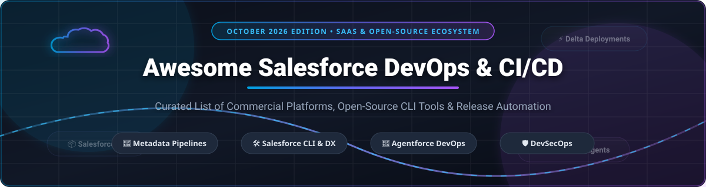
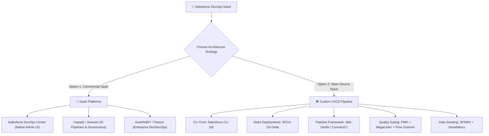

# ⚡ Awesome Salesforce DevOps & CI/CD

  
  
  
  
  

## 🚀 Top Salesforce DevOps & CI/CD Ecosystem

**Curated List of Commercial SaaS Products & Open-Source GitHub Repositories**  
*Focused on Metadata Deployment, Release Management, Salesforce DX (SFDX), DevSecOps & Automated CI/CD Pipelines*  

📅 **Last updated: October 2026**

---

### 📌 Overview

This repository tracks notable **commercial Salesforce DevOps platforms** and **open-source GitHub projects** that automate metadata deployment, version control, static code analysis, unit testing, and release management for Salesforce orgs — ranging from click-based administrative release centers to highly custom, scriptable CI/CD pipelines built on the **Salesforce CLI (`sf`/`sfdx`)**.

Whether you are an Admin scaling your first deployment pipeline, a Lead Developer optimizing scratch org flows, or a DevSecOps Architect implementing enterprise governance for **Agentforce**, this guide provides structured insights into pricing, trial limits, market valuations, and star-rated open-source tools.

---

## 📑 Table of Contents

- [🏢 SaaS / Hosted DevOps Platforms](#-saas--hosted-devops-platforms)
- [🛠️ Open-Source GitHub Repositories (Sorted by Stars)](#️-open-source-github-repositories-sorted-by-stars)
  - [1. 🛡️ Code Quality & Static Analysis](#1-️-code-quality--static-analysis)
  - [2. 📦 Deployment, Delta & Data Management](#2--deployment-delta--data-management)
  - [3. ⚙️ CI/CD Frameworks & CLI Toolboxes](#3-️-cicd-frameworks--cli-toolboxes)
  - [4. 🧪 Testing & Mocking Frameworks](#4--testing--mocking-frameworks)
- [💡 Architectural Guide: Open-Source vs SaaS](#-architectural-guide-open-source-vs-saas)
- [🤝 How to Contribute](#-how-to-contribute)
- [💖 Support](#-support)
- [⭐ Star History](#-star-history)
- [📜 Disclaimer & Governance](#-disclaimer--governance)

---

## 🏢 SaaS / Hosted DevOps Platforms

> 📈 **Market Size & Industry Landscape**:  
> The global **Salesforce DevOps & Release Management sector** is estimated at **~$1.8B – $2.5B (2026)**, expanding at a CAGR of **~22%**. The market is **moderately fragmented**: while native solutions like *Salesforce DevOps Center* and market category leaders (*Copado*, *Gearset*) command significant enterprise market share, specialized vendors compete actively across niche domains including DevSecOps (*AutoRABIT*, *Flosum*), SaaS configuration management (*Salto*), CPQ relational data migration (*Prodly*), automated code reviews (*Clayton*), and lightweight scratch org management (*Hutte*, *Blue Canvas*).

The table below lists top commercial SaaS Salesforce DevOps solutions, sorted by **Estimated Valuation / Company Size (Descending)**.

| Platform / Tool | 📊 Est. Valuation / Size | 💰 Starting Price | 🎁 Free Tier / Free Trial Limits | 🌟 Key Focus & Best For |
| :--- | :--- | :--- | :--- | :--- |
| **[Salesforce DevOps Center](https://help.salesforce.com/)** | **~$340B Market Cap** *(Salesforce Inc.)* | **Free / $0** base ($15/user/mo for custom pipeline extensions) | **Free forever** with Enterprise, Unlimited, and Developer Edition orgs | **Native click-based release management** — visual pipelines, automatic Git tracking, Agentforce conflict assistance. Best for Salesforce admins. |
| **[Copado](https://www.copado.com/)** | **~$1.2B Valuation** *($300M+ raised)* | **$250 / user / month** *(Starter Plan)* | **14-day free trial** *(Access to Copado DevOps & CI/CD features in dev orgs)* | **AI-powered enterprise DevOps** — Agentia™ AI agents for Plan, Build, Test & Release with built-in audit trails. Best for large enterprises. |
| **[Gearset](https://gearset.com/)** | **~$300M+ Valuation** *($50M+ ARR)* | **$200 / user / month** *(Pro Plan)* | **30-day free trial** *(Full feature access, no credit card required)* | **Trusted compare & deploy platform** — Gitflow pipelines, PR queuing, continuous delivery rules, and data deployment. Best for scaling dev teams. |
| **[AutoRABIT](https://www.autorabit.com/)** | **~$150M Valuation** *($50M+ raised)* | **$1,500 / month** *(Team Starter tier)* | **14-day free trial** *(Available upon request for sandbox evaluation)* | **Enterprise DevSecOps suite** — Automated Release Management (ARM), CodeScan static analysis, and Vault automated backup. Best for regulated industries. |
| **[Flosum](https://www.flosum.com/)** | **~$100M+ Valuation** | **$1,200 / org / month** | **14-day free trial** *(Full sandbox migration & metadata deployment testing)* | **Purpose-built DevSecOps & Agentic DevOps** — Built natively on Salesforce with data residency compliance & Agentforce governance. Best for enterprise security. |
| **[Salto](https://www.salto.io/)** | **~$100M Valuation** *($67M raised)* | **$500 / month** *(Starter Tier)* | **30-day free trial** *(Unlimited metadata extraction & comparison)* | **SaaS configuration management** — NaCl configuration language for cross-org metadata diffing, Git versioning, and environment tracking. |
| **[Prodly](https://prodly.co/)** | **~$50M Valuation** *($20M+ raised)* | **$450 / user / month** | **14-day free trial** *(Via AppExchange installer demo package)* | **Relational data & CPQ DevOps** — Deploys complex data schemas (CPQ, Vlocity, Billing) across sandboxes with automated relationship mapping. |
| **[Clayton](https://clayton.io/)** | **~$20M Valuation** *($3M+ seed)* | **€120 / user / month** *(~$130/user/mo)* | **14-day free trial** *(Automated security scans for 1 repository)* | **Automated code review & security governance** — AI-assisted static code analysis, SAST, and technical debt enforcement for Apex & LWC. |
| **[Blue Canvas](https://bluecanvas.io/)** | **~$15M Valuation** | **$99 / developer / month** | **14-day free trial** *(Instant Git synchronization for 2 orgs)* | **Automated Git version control** — Real-time continuous metadata backup, visual diffs, and fast rollback capabilities for Salesforce orgs. |
| **[Hutte](https://hutte.io/)** | **~$10M Valuation** | **$35 / user / month** *(Basic Plan)* | **14-day free trial** *(Up to 3 scratch orgs & 2 users)* | **No-code UI for Salesforce DX** — Enables admins to spin up scratch orgs, execute Git pushes/pulls, and trigger CI/CD pipelines without terminal CLI commands. |

---

## 🛠️ Open-Source GitHub Repositories (Sorted by Stars)

The open-source Salesforce ecosystem provides powerful building blocks for custom CI/CD pipelines, package generation, static code analysis, and test data seeding.

Repositories below are sorted strictly by **GitHub Stars_Count (Descending)**. Beside each project name is a live social Stars_Badge linking directly to the repo's **Stargazers** page.

---

### 1. 🛡️ Code Quality & Static Analysis

* **[PMD](https://github.com/pmd/pmd)**   
  🏆 **5,499 Stars**  
  - **Extensible multi-language static code analyzer** with specialized rulesets for Salesforce Apex and Visualforce.  
  - Detects anti-patterns, SOQL inside loops, unused variables, and security flaws before code commit.  
  - **Best for:** Core static code analysis in any custom CI/CD pipeline.

* **[MegaLinter](https://github.com/oxsecurity/megalinter)**   
  🏆 **2,612 Stars**  
  - **Open-source linter aggregator for CI/CD**, offering a dedicated Salesforce flavor (`megalinter-salesforce`).  
  - Scans Apex, Lightning Web Components (LWC), metadata XML, JSON, and YAML files in a single pass.  
  - **Best for:** All-in-one repository quality gating in GitHub Actions or GitLab CI.

* **[Prettier Plugin Apex](https://github.com/dangmai/prettier-plugin-apex)**   
  🏆 **274 Stars**  
  - **Official Prettier code formatter plugin for Apex**, bringing consistent syntax formatting across development teams.  
  - Integrates seamlessly with VS Code, Git pre-commit hooks (Husky), and automated formatting CI steps.  
  - **Best for:** Standardizing Apex formatting across org repositories.

* **[Salesforce Code Analyzer](https://github.com/forcedotcom/sfdx-scanner)**   
  🏆 **241 Stars**  
  - **Official Salesforce static analysis aggregator CLI plugin** (`sf scanner` / `sfdx-scanner`).  
  - Bundles PMD, ESLint, Copy-Paste Detector (CPD), and Security Scanning into one unified command.  
  - **Best for:** Standardized local CLI and CI security scanning endorsed by Salesforce.

* **[Lightning Flow Scanner](https://github.com/Flow-Scanner/lightning-flow-scanner)**   
  🏆 **176 Stars**  
  - **Static analysis engine for Salesforce Flows**, featuring 20+ community-driven rules.  
  - Flags hardcoded IDs, missing fault paths, unhandled DML, recursion risks, and governance violations in Flow XML metadata.  
  - **Best for:** Automated Flow quality checks in CI/CD pipelines.

* **[ESLint Plugin Aura](https://github.com/forcedotcom/eslint-plugin-aura)**   
  🏆 **29 Stars**  
  - **Official ESLint ruleset for Salesforce Lightning Aura Components**.  
  - Enforces JavaScript best practices and deprecated API warnings for legacy Aura codebases.  
  - **Best for:** Linting JavaScript controllers and helpers in Aura projects.

---

### 2. 📦 Deployment, Delta & Data Management

* **[Salesforce CLI](https://github.com/forcedotcom/cli)**   
  🏆 **571 Stars**  
  - **The official command-line interface (`sf`) for Salesforce DX**.  
  - Provides core primitives for scratch org management, metadata deployments, package creation, and source tracking.  
  - **Best for:** Foundation tool underlying all open-source and commercial Salesforce automation.

* **[SFDX-Git-Delta (sfdx-git-delta)](https://github.com/scolladon/sfdx-git-delta)**   
  🏆 **568 Stars**  
  - **Generates delta packages (`package.xml` & `destructiveChanges.xml`) from Git diffs**.  
  - Ensures CI/CD pipelines only deploy changed metadata between commits rather than full org deployments.  
  - **Best for:** Dramatically reducing deployment times in large enterprise Salesforce orgs.

* **[SFDX Data Move Utility (SFDMU)](https://github.com/forcedotcom/SFDX-Data-Move-Utility)**   
  🏆 **552 Stars**  
  - **Advanced data migration & sandbox seeding CLI plugin**.  
  - Populates sandboxes with complex relational data schemas across multiple related sObjects while preserving lookup relationships.  
  - **Best for:** Fast sandbox data seeding and developer environment setup.

* **[Snowfakery](https://github.com/SFDO-Tooling/Snowfakery)**   
  🏆 **160 Stars**  
  - **Open-source tool for generating synthetic test data for Salesforce**.  
  - Creates millions of realistic, relational mock records based on YAML recipe definitions.  
  - **Best for:** Scale testing, performance benchmarking, and privacy-compliant data generation.

* **[Texei SFDX Plugin](https://github.com/texei/texei-sfdx-plugin)**   
  🏆 **124 Stars**  
  - **Custom Salesforce DX CLI plugin** offering utility commands for org management, data import/export, and object schema tweaks.  
  - Simplifies common release engineering workarounds.  
  - **Best for:** Enhancing local developer workflows and script automation.

---

### 3. ⚙️ CI/CD Frameworks & CLI Toolboxes

* **[sfdx-hardis](https://github.com/hardisgroupcom/sfdx-hardis)**   
  🏆 **403 Stars**  
  - **Complete open-source Salesforce DevOps toolbox**, presented at Dreamforce by Cloudity.  
  - Features interactive setup wizards, automated CI/CD pipeline definitions, daily metadata backups, org health monitoring, and AI-enhanced documentation.  
  - Supplies official Docker container images pre-loaded with CLI tools and AI coding agent helpers (Claude, Codex, Copilot).  
  - **Best for:** Turnkey open-source Salesforce DevOps pipelines with container support.

* **[CumulusCI](https://github.com/SFDO-Tooling/CumulusCI)**   
  🏆 **401 Stars**  
  - **Salesforce.org's Python-based automation framework** for building portable release pipelines.  
  - Automates scratch org creation, dependency resolution, sample dataset loading, and end-to-end browser testing via Robot Framework.  
  - **Best for:** ISV package development and complex non-profit/enterprise org orchestrations.

* **[sfpowerkit](https://github.com/dxatscale/sfpowerkit)**   
  🏆 **386 Stars**  
  - **DX@Scale CLI plugin packed with org and metadata management helpers**.  
  - Includes commands for profile cleans, scratch org pool maintenance, and unlocking locked packages.  
  - **Best for:** Advanced metadata manipulations in CI scripts.

* **[sfpowerscripts](https://github.com/dxatscale/sfpowerscripts)**   
  🏆 **214 Stars**  
  - **Package-based CI/CD orchestrator for DX@Scale architecture**.  
  - Manages artifact generation, scratch org pool management, version tagging, and automated multi-package release promotions.  
  - **Best for:** Large enterprise orgs adopting modular, package-based development.

* **[vscode-sfdx-hardis](https://github.com/hardisgroupcom/vscode-sfdx-hardis)**   
  🏆 **62 Stars**  
  - **VS Code Extension for sfdx-hardis**, exposing open-source DevOps tasks directly inside the IDE.  
  - Enables developers to run deployments, backups, and monitoring actions without typing CLI commands.  
  - **Best for:** Developer desktop GUI integration.

---

### 4. 🧪 Testing & Mocking Frameworks

* **[fflib-apex-mocks](https://github.com/financialforcedev/fflib-apex-mocks)**   
  🏆 **462 Stars**  
  - **Apex stubbing and mocking framework** based on Java's Mockito.  
  - Enables true unit testing in Apex by mocking SOQL queries, web service callouts, and sObject dependencies without database access.  
  - **Best for:** Fast, database-independent Apex unit test suites in CI pipelines.

---

## 💡 Architectural Guide: Open-Source vs SaaS

### ⚡ Key Architectural Considerations:
1. **Delta Deployments are Essential**: In large orgs with thousands of metadata components, deploying full metadata trees on every commit causes deployment timeouts. Using **SFDX-Git-Delta** reduces deployment payload sizes by 90%+.
2. **AI & Agentforce Governance**: Commercial platforms (Copado Agentia, Salesforce DevOps Center Agentforce Assistant) provide native guardrails for managing Agentforce prompts and bot flows. For open-source setups, pair **sfdx-hardis Docker images** with AI coding agents in GitHub Actions.
3. **Data Residency & Security**: Regulated industries (Finance, Healthcare, Defense) often prefer **Flosum** (native on-org storage) or self-hosted open-source runners (GitHub Actions / GitLab CI) over multi-tenant external SaaS engines.

---

## 🤝 How to Contribute

Contributions are warmly welcomed! Help keep this ecosystem index accurate, up-to-date, and valuable for the global Trailblazer community.

1. **Fork** this repository.
2. **Add or update** entries in `README.md` following the tabular format for SaaS or star-sorted list for Open-Source projects.
3. **Ensure strict data accuracy**: Include vendor details, verified starting prices, specific trial limits, and exact GitHub repo links.
4. **Submit a Pull Request** with a clear title and summary of changes.

⭐ **If you find this list helpful, please star the repository!**

---

## 💖 Support

Thank you so much for using and contributing to this Salesforce DevOps ecosystem guide! 

If this curated repository has helped you save time, architect a CI/CD pipeline, or choose the right Salesforce release management tools for your organization, please consider supporting the project:

- ⭐ **Star this repository** to help others discover it.
- 🍴 **Fork and share** it with your team, Trailblazer community groups, and colleagues.
- ☕ **Sponsor / Buy a coffee**: If you'd like to support ongoing updates and open-source maintenance, visit the [GitHub Sponsor Dashboard](https://github.com/sponsors/ishandutta2007).

Your support is deeply appreciated! 🙌

---

## ⭐ Star History

---

## 📜 Disclaimer & Governance

- This repository is a **community-curated index** created for educational and architectural reference purposes. It is not affiliated with or endorsed by Salesforce, Inc.
- Salesforce DevOps platforms process sensitive org metadata, source code, and potentially sandbox data. Always verify security posture, SOC2 compliance, and data handling policies prior to third-party integration.
- **CumulusCI** and **sfdx-hardis** are open-source projects released under their respective open-source licenses and are not covered by the Salesforce Master Subscription Agreement.

---

  <b>Made with ❤️ for Salesforce Developers, Admins, Architects & Release Engineers worldwide.</b>

